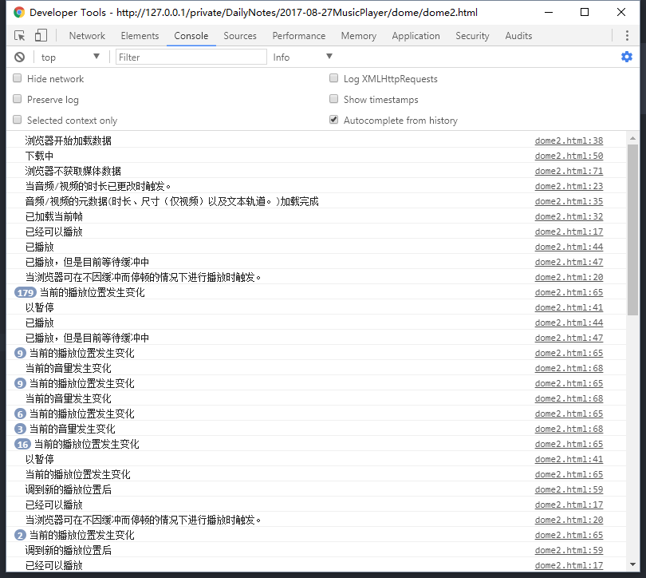

# MusicPlayer

    ff
    2017-08-27 15:39:53
    工作需求：要求实现一个音乐播放器，具备基本功能

## audio 标签

先从基础开始学习 -- audio 标签

### audio 的基础知识

1. audio 是属于 HTML 5 新增标签，目前支持的浏览器有： IE9+， Firefox，chrome，Safari，Opera；
2. audio 用于定义音频流
3. 使用 `<audio src="http://ws.stream.qqmusic.qq.com/107506656.m4a?fromtag=46">您的浏览器版本过低，请使用现在浏览器<audio>` 可以在页面中插入一个播放器；
4. audio 的基本属性：
    - autoplay: 是否自动播放；

        ```html
            <audio 
                src="http://ws.stream.qqmusic.qq.com/7214464.m4a?fromtag=46" 
                autoplay 
                muted
                controls="controls">
            </audio>
        ```
    - controls: 是否具有浏览器自带控制条
    - loop：是否循环播放
    - muted：是否静音
    - preload：音频将会在页面加载的时候就进行加载，而不是当音频开始播放的时候才开始加载
    - src：要播放的音频的 URL
    上述的所有属性的使用方法都是一样的，如果存在于标签上就说明已经开始使用了

- 注：如果使用线上地址，就需要在服务器环境下才能播放；

## audio 对象

### audio 对象属性

```js
        var audio = document.querySelector('audio');
    console.log(audio);
    /*
        * AudioTrack  表示音视频的可用音轨。
        * 
        * AudioTrack 对象的属性：
        * id - 获得音轨的 id
        * kind - 获得音轨的类型（可以是 "alternative", "description", "main", "translation", "commentary", 或者 "" （空字符串））
        * label - 获得音轨的标签
        * language - 获得音轨的语言
        * enabled - 获得或设置音轨是否是活动的 (true|false)
        */ 
    console.log(audio.audioTracks) // undefined -- 返回表示可用于音频轨道的 AudioTrack 对象
    console.log(audio.autoplay) // true 
    console.log(audio.buffered) // 表示已经缓冲的部分
    console.log(audio.controller) // 返回表示音频当前媒体控制器的 MediaController 对象。目前没有浏览器支持
    console.log(audio.controls) // true
    console.log(audio.crossOrigin) //	设置或返回音频的 CORS 设置。
    console.log(audio.currentSrc) // 返回当前音频的 URL。
    console.log(audio.currentTime) // 设置或返回音频中的当前播放位置（以秒计）

    //只有 Google Chrome 和 Safari 6浏览器 支持 defaultMuted 属性。
    console.log(audio.defaultMuted) // 	设置或返回音频默认是否静音。
    console.log(audio.defaultPlaybackRate) // 设置或返回音频的默认播放速度。Safari 浏览器不支持
    console.log(audio.duration) // 	返回音频的长度（以秒计）。
    console.log(audio.ended) // 返回音频的播放是否已结束。
    console.log(audio.error) // 返回表示音频错误状态的 MediaError 对象。 目前只有 Internet Explorer 浏览器支持 error 属性。
    console.log(audio.loop) // 设置或返回音频是否应在结束时再次播放
    /**
        * mediaGroup 属性设置或返回音频/视频所属的媒体组合的名称。媒体分组允许两个或更多音频/视频元素保持同步。
        * 但是没有实现
        */
    console.log(audio.mediaGroup) // 设置或返回音频是否应在结束时再次播放
    console.log(audio.muted) // 	设置或返回是否关闭声音
    /*
    *   0 = NETWORK_EMPTY - 音频/视频尚未初始化
    *   1 = NETWORK_IDLE - 音频/视频是活动的且已选取资源，但并未使用网络
    *   2 = NETWORK_LOADING - 浏览器正在下载数据
    *   3 = NETWORK_NO_SOURCE - 未找到音频/视频来源
    */ 
    console.log(audio.networkState) // 返回音频的当前网络状态。
    console.log(audio.paused) // 设置或返回音频是否暂停。
    console.log(audio.playbackRate) // 设置或返回音频播放的速度。

    console.log(audio.played) //返回表示音频已播放部分的 TimeRanges 对象。
    console.log(audio.preload) // 设置或返回音频的 preload 属性的值。

    console.log(audio.readyState) // 返回音频当前的就绪状态。
    console.log(audio.seekable) // 返回表示音频可寻址部分的 TimeRanges 对象。
    console.log(audio.seeking) // 返回用户当前是否正在音频中进行查找 拖动进度条时才为真

    console.log(audio.src) // 设置或返回音频的 src 属性的值。

    console.log(audio.textTracks) // 返回表示可用文本轨道的 TextTrackList 对象。  Firefox 和 Internet Explorer 9 及更早IE版本不支持 textTracks 属性。

    console.log(audio.volume) // 设置或返回音频的音量。从 0.0 (静音) 到 1.0 (最大声)。
``` 

### audio 对象的方法

    addTextTrack() 向音频添加新的文本轨道。  
    canPlayType() 检查浏览器是否能够播放指定的音频类型。  
    fastSeek() 在音频播放器中指定播放时间。  
    getStartDate() 返回新的 Date 对象，表示当前时间线偏移量。
    load() 重新加载音频元素。
    play() 开始播放音频。
    pause() 暂停当前播放的音频。

## HTML 音频/视频事件

```js
    var audio = document.querySelector('audio');
    audio.oncanplay = function () {
        console.log('已经可以播放')  // (7)
    }
    audio.oncanplaythrough = function () {
        console.log('当浏览器可在不因缓冲而停顿的情况下进行播放时触发。')  // (10)
    }
    audio.ondurationchange = function () {
        console.log('当音频/视频的时长已更改时触发。')  // (4)
    }
    audio.onemptied = function () {
        console.log('当目前的播放列表为空时触发。')
    }
    audio.onended = function () {
        console.log('视频播放结束')
    }
    audio.onloadeddata = function (){ 
        console.log('已加载当前帧') // (6)
    }
    audio.onloadedmetadata = function (){
        console.log('音频/视频的元数据(时长、尺寸（仅视频）以及文本轨道。)加载完成')  // (5)
    }
    audio.onloadstart = function (){
        console.log('浏览器开始加载数据') // (1)
    }
    audio.onpause = function (){
        console.log('以暂停')
    }
    audio.onplay = function (){
        console.log('已播放')  // (8)
    }
    audio.onplaying = function (){
        console.log('已播放，但是目前等待缓冲中')  // (9)
    }
    audio.onprogress = function (){
        console.log('下载中') // (2)
    }
    audio.onratechange = function (){
        console.log('播放速率已经发生改变')
    }
    audio.onstalled = function (){
        console.log('数据不可用')
    }
    audio.onseeked = function (){
        console.log('调到新的播放位置后')
    }
    audio.onstalled = function (){
        console.log('调到新的播放位置前')
    }
    audio.ontimeupdate = function (){
        console.log('当前的播放位置发生变化') // 持续触发 (11)
    }
    audio.onvolumechange = function (){
        console.log('当前的音量发生变化')
    }
    audio.onsuspend = function (){
        console.log('浏览器不获取媒体数据') // (3)
    }
    // waiting -- 当视频由于需要缓冲下一帧而停止时触发。
```

产出：



## 实例

