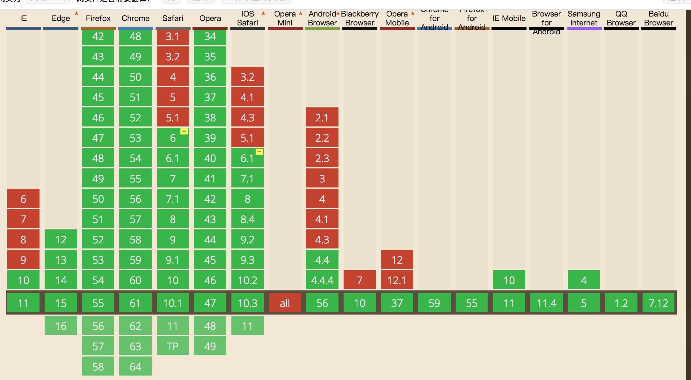

# 如何使用 Tween.js 制作动画

    2017-09-10    FF
    原文链接：[如何使用Tween.js各类原生动画运动缓动算法](http://www.zhangxinxu.com/wordpress/2016/12/how-use-tween-js-animation-easing/)
    原文作者：张鑫旭

## 前言

工作需要输出各种动画效果，css 中的 animate 以及 transition 都有局限性，而且 JQ 中的 animate 只能实现一些简易的运动。如果希望能够得到更好、更加灵活的运动，就还是需要对运动有个实质性的了解。

运动，就是不断刷新出页面中元素的位置，从而产生一种连续运动的效果，其中的关键自然就在于如何得知响应的时间下对应的运动位置。

## 实现

### 1.1 Tween.js

[Tween.js](./tween.js)

- 运动形式：

    Quad, Cubic等等都是经典的动画运动算法名称，完整列表如下：

    1. Linear：线性匀速运动效果；
    1. Quadratic：二次方的缓动（t^2）；
    1. Cubic：三次方的缓动（t^3）；
    1. Quartic：四次方的缓动（t^4）；
    1. Quintic：五次方的缓动（t^5）；
    1. Sinusoidal：正弦曲线的缓动（sin(t)）；
    1. Exponential：指数曲线的缓动（2^t）；
    1. Circular：圆形曲线的缓动（sqrt(1-t^2)）；
    1. Elastic：指数衰减的正弦曲线缓动；
    1. Back：超过范围的三次方缓动（(s+1)*t^3 – s*t^2）；
    1. Bounce：指数衰减的反弹缓动。

    并且每一种运动方式都对应着 3 中运动形式：

    1. easeIn -- 先慢后快
    2. easeOut -- 先快后面
    3. easeInOut -- 慢快慢

- 运动参数

    - t: current time（当前时间）；
    - b: beginning value（初始值）；
    - c: change in value（变化量）；
    - d: duration（持续时间）。

- 解释

    运动函数返回的是在 t 时间的时候，元素在运动中应该处于什么位置（这个不仅仅是用于运动）；d 是指我们希望在这个时间内完成从 b 到 b + c 的变化；

    示例：
    
        ```js
            var pos = Math.tween.Linear(50, 0, 1000, 100);
            console.log(pos); // 500

            var pos2 = Math.tween.Quad.easeOut(50, 0, 1000, 100);
            console.log(pos2); // 750
        ```

- 实际使用 Tween.js

    可以看出 Tween.js 解决了运动过程中最大的问题 -- 位置；但是同样看出，我们得到的只是某一个时间点的位置；如果需要得到一个完整的动画我们就需要能够得到一个完整的运动轨迹：

    示例：

        ```js
            var moveEl = document.querySelector('div');
            var t = 0, timer;
            timer =setInterval(function (){

                t += 20;
                posx = Math.tween.Linear(t, 0, 1000, 3000);
                moveEl.style = "transform:translateX("+ posx +"px)"
                if (t >= 3000 ) {
                    clearInterval(timer);
                }
            }, 20)
        ``` 

    [DOME](./tween.html)

### 1.2 requestAnimationFrame

- 什么是 requestAnimationFrame

    requestAnimationFrame 是能够根据实际显示器的刷新频率来执行函数的方法，在使用 setInterval 来计算运动位置的时候，可能会存在这样一种文体：当你设置的运动间隔小于显示器的刷新频率的时候，你就会明显感觉到丢帧的现象（文中表示显示器的刷新频率多说在 16.7 ms），而如果能够自动按照显示器的刷新频率来执行动画，那么动画自然会显示的十分流畅；

    在使用 requestAnimationFrame 时，就像当显示器每一次刷新的同时来执行，而不是通过内部计算来限定执行时间，这样就会更加高效，及时即使是一个页面使用了多个 requestAnimationFrame，也不会多次计算运动时间；

    并且如果页面被收起，或者切换到别的页面的时候，当前的页面刷新就是 0，运动就会停止，而不是像定时器一般，减少计算速度，到时计算和实际不符的问题

    感人的兼容：
    

- animate 与 transition

    CSS3 transition或animation动画也是走的跟你一样的绘制原理（补充于2013-10-09：根据自己后来的测试，发现，CSS3动画在Tab切换回来的时候，动画表现并不暂停；通过Chrome frames工具测试发现，Tab切换之后，计算渲染绘制都停止，Tab切换回来时似乎通过内置JS计算了动画位置实现重绘，造成动画不暂停的感觉）。

- requireAnimationFrame 和 cancleAnimationFrame

    requireAnimationFrame() 是开启行为, 会返回一个 ID
    cancleAnimationFrame(ID) 可以停止动画针

        ```js
            // http://paulirish.com/2011/requestanimationframe-for-smart-animating/
            // http://my.opera.com/emoller/blog/2011/12/20/requestanimationframe-for-smart-er-animating
            // requestAnimationFrame polyfill by Erik M ller. fixes from Paul Irish and Tino Zijdel
            // MIT license
            (function () {
                var lastTime = 0;
                var vendors = ['ms', 'moz', 'webkit', 'o'];
                for (var x = 0; x < vendors.length && !window.requestAnimationFrame; ++x) {
                    window.requestAnimationFrame = window[vendors[x] + 'RequestAnimationFrame'];
                    window.cancelAnimationFrame = window[vendors[x] + 'CancelAnimationFrame'] || window[vendors[x] +
                        'CancelRequestAnimationFrame'];
                }
                if (!window.requestAnimationFrame) window.requestAnimationFrame = function (callback, element) {
                    var currTime = new Date().getTime();
                    var timeToCall = Math.max(0, 16 - (currTime - lastTime));
                    var id = window.setTimeout(function () {
                        callback(currTime + timeToCall);
                    }, timeToCall);
                    lastTime = currTime + timeToCall;
                    return id;
                };
                if (!window.cancelAnimationFrame) window.cancelAnimationFrame = function (id) {
                    clearTimeout(id);
                };
            }());
        ```

- 实例：

        ```js
            var moveEl = document.querySelector('div');
            var t = 0, posx, timer;
            var run = function (){
                t ++;
                posx = Math.tween.Linear(t, 0, 1000, 3000);
                moveEl.style = "transform:translateX("+ posx +"px)"
                if (t >= 3000 ) {
                    console.log('运动结束')
                } else {
                    timer = requestAnimationFrame(run)
                }
            }
            window.onclick = function () {
                cancelAnimationFrame(timer);
            }
            run()
        ```
    [DOME](./animateTween.html)
    
- 注：
    1. 根据这篇翻译文章一些测试说法，FireFox/Chrome浏览器对setInterval, setTimeout做了优化，页面处于闲置状态的时候，如果定时间隔小于1秒钟(1000ms)，则停止了定时器。与requestAnimationFrame有类似行为。但如果时间间隔大于或等于1000ms，定时器依然执行，即使页面最小化或非激活状态。
    2. 一定不要忽视，requireAnimationFrame 一次只执行一回，虽然看描述貌似是想 setInterval

### 1.3 animation.js 

animation.js 是对 Tween.js 的封装，使其更加容易使用

[animation.js](./animation.js)

animation 是一个十分简单，但是特别有意思的方法，虽然代码量不是很多，但是表现了很多细节是可以学习的；可以研究一下；

语法如下：`Math.animation(form, to, duration, easing, callback);

## 2 其它


具体的实现原理基本相同，只是数学知识流失的太快了